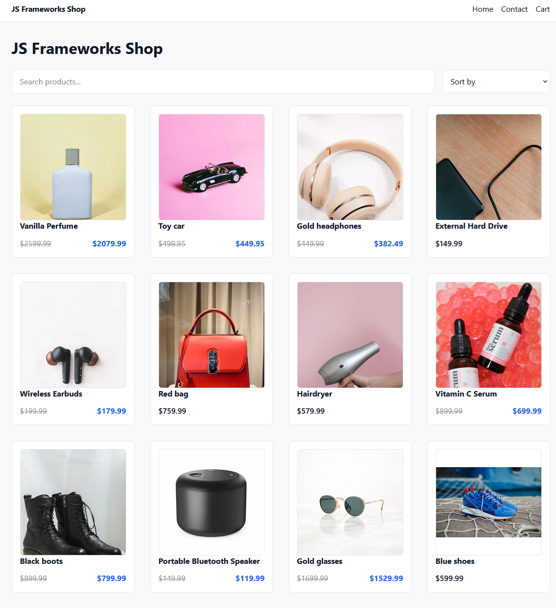

# JS Frameworks Shop 🛒

---

## Description

**JS Frameworks Shop** is a simple online store built as part of the **JavaScript Frameworks course at Noroff – School of Technology and Digital Media**.

The goal of the project is to demonstrate skills in **React / Next.js, TypeScript, API integration, and state management**.

The application allows users to browse products, view product details, search and sort items, add products to a cart, and complete a checkout flow.

---

## Built With 🛠️

- Next.js (App Router)
- React
- TypeScript
- CSS Modules
- Context API + useReducer
- LocalStorage (cart persistence)
- Noroff Online Shop API

---

## Features ✨

- **🛍️ Product Listing**: Browse all products from the API.
- **📄 Product Page**: View detailed product information.
- **🔎 Search**: Filter products by name.
- **↕️ Sorting**: Sort products by price (low → high / high → low).
- **💸 Discount Support**: Displays discounted prices across the entire app.
- **🛒 Shopping Cart**:
  - Add/remove items
  - Adjust quantity
  - Persistent cart using localStorage
- **💳 Checkout Flow**:
  - Form validation
  - Order summary
  - Success page with order details
- **⭐ Product Data**:
  - Rating
  - Tags
  - Reviews
- **📱 Responsive Design**: Works across desktop and mobile.

---

## Installation 💻

To run the project locally:

1. **Clone the repository**:

   git clone https://github.com/NoroffFEU/jsfw-2025-v1-raddishai-jsf.git

2. **Navigate to the project folder**:

   cd js-frameworks-shop

3. **Install dependencies**:

   npm install

4. **Run the development server**:

   npm run dev

5. Open in browser:

   http://localhost:3000

---

## Usage 📖

1. Browse products on the homepage
2. Use search or sorting to find items
3. Click a product to view details
4. Add items to cart
5. Go to checkout and fill in required fields
6. Complete purchase and view order summary

---

## Requirements & Links 📌

- **GitHub Repository**: https://github.com/NoroffFEU/jsfw-2025-v1-raddishai-jsf

---

## Contact Me 📬

- LinkedIn: https://www.linkedin.com/in/petter-r%C3%B8nning-80602613a/
- Email: petter.arbeid@gmail.com
- Portfolio: https://raddishaisportfolio.netlify.app/

---

## Credits 🎉

This project was built by me with the help of **ChatGPT** and **DeepSeek**,
which were used as a learning assistant for debugging, structuring code, and understanding concepts.

All code was reviewed, understood, and adapted manually.

A special thanks to my girlfriend, who helped out at home so I could focus on finishing the project.
